AI Health Profile Analyzer
===========================
An intelligent backend service that analyzes health survey data to provide risk assessments and personalized, AI-generated recommendations. The service can process data from either an uploaded image of a survey form (using OCR) or a direct JSON payload.

...

---

## 🚀 Live Demo

This project is deployed on Google Cloud Run. You can access the live API endpoint here:

**[https://health-risk-profiler-api-310335320038.asia-south1.run.app/](https://health-risk-profiler-api-310335320038.asia-south1.run.app/)**

**Note:** The free-tier instance may take a few seconds to "wake up" on the first request if it has been idle.

...


Key Features
--------------
Dual Input: Accepts health data via image upload or JSON object.

OCR Processing: Automatically extracts key-value data from survey images using Tesseract.js.

Multi-Stage AI Pipeline: Uses the Google Gemini API for a sophisticated analysis workflow:

Identifies health risk factors.

Classifies the overall risk level.

Generates actionable, non-diagnostic recommendations.

Robust & Resilient: Includes guardrails for incomplete data and retry logic for API calls.

🏛️ Architecture & Workflow
=================================
The application operates as a linear, multi-stage pipeline. A single POST request triggers a sequence of processing, analysis, and generation steps, culminating in a comprehensive JSON report.

The diagram below illustrates the complete data flow from the initial request to the final response.

Code snippet

``` mermaid
graph TD
    subgraph "Client"
        A[POST Request]
    end

    subgraph "Server: Input Processing (Stage 1)"
        B{ / Endpoint}
        C{Image or JSON?}
        C -- Image Upload --> D[📁 Multer Middleware]
        D --> E[🖼️ Preprocess Image w/ Jimp]
        E --> F[🔍 Extract Text w/ Tesseract.js]
        F --> G[📝 Parse & Structure Data]
        C -- JSON Payload --> G
        G --> H{Guardrail: Check for >50% missing data}
    end
    
    subgraph "Server: AI Analysis Pipeline (Stages 2-4)"
        I[🧠 Gemini: Extract Risk Factors]
        J[🧠 Gemini: Classify Risk Level & Score]
        K[🧠 Gemini: Generate Recommendations]
    end

    subgraph "Server: Response"
        L[📋 Assemble Final JSON Report]
        M[✅ 200 OK Response]
        N[❌ Error Response]
    end

    A --> B --> C
    H -- Pass --> I
    H -- Fail --> N
    I --> J --> K --> L --> M
```

🤖 AI System Prompts
=======================
The core intelligence of this service comes from carefully crafted prompts sent to the Google Gemini API. Each stage of the AI pipeline uses a specific system prompt to ensure a structured and reliable JSON output.

1. Risk Factor Extraction (getRiskFactors)
```
You are a health data summarizer. For each lifestyle habit provided, identify the key factor and describe it in a clear, professional phrase (e.g., 'High sugar intake', 'Lack of physical activity', 'Moderate alcohol consumption'). You must summarize every category provided. Your response MUST be a single, valid JSON object with a 'risk_factors' key holding an array of strings, and another key confidence value between 0 and 1 telling how confident we are about this risk factors.
```
2. Risk Classification (getRiskClassification)
```
You are a health risk classifier.
Based on the provided risk factors, compute a simple NON-DIAGNOSTIC score (0–100),
assign a risk level (low, moderate, high), and return the rationale.

"risk_level": one of "low", "moderate", "high"

"score": an integer 0-100

"rationale": array of the main risk factor strings
Your response MUST be a single, valid JSON object.
```
3. Recommendation Generation (getRecommendations)
```
You are a helpful and encouraging health advisor. For each lifestyle factor provided, generate one simple, actionable, and non-diagnostic recommendation with a supportive tone. Your response MUST be a single, valid JSON object. The top-level key must be 'recommendations', holding a list of objects, where each object has two keys: 'factor' and 'recommendation'.
```
📂 Project Structure
=======================
The project is organized into distinct modules for routing, controllers, and utilities, promoting separation of concerns and maintainability.
```
/
├── controller/
│   └── profile.controller.js  # Core application logic and pipeline orchestration
├── router/
│   └── profile.routes.js      # API route definitions using Express Router
├── utils/
│   ├── gemini/
│   │   └── geminiApi.js       # Manages all API calls to Google Gemini
│   └── ocr_processing/
│       └── processor.js       # Handles image preprocessing, OCR, and text parsing
├── uploads/                     # Temporary storage for uploaded images (auto-generated)
├── assets/
│       └── input_sample_pic.jeg
├── .env.example               # Environment variable template
├── package.json
├── server.js                  # Express server setup and application entry point
└── README.md

```
🚀 Getting Started
=====================
Follow these instructions to get a local copy of the project up and running.

Prerequisites
Node.js (v22.x or later)
git initialization and cloing
--------
bash
```
git clone https://github.com/RamanujaLokesh/ai_powered_health_risk_profile.git
cd ai_powered_health_risk_profile
```

Set up environment variables:
--------------------------------
Create a .env file in the root directory by copying the example file.


Code snippet
```
# .env
PORT=3000
GOOGLE_API_KEY="YOUR_GEMINI_API_KEY_HERE"
```
Run the server:
----------------

Bash
```
npm install 
node server.js
```
The server will be running at http://localhost:3000.

✨ API Usage
===================
The service exposes a single endpoint for all operations.


You can test the API endpoints against the live deployed instance or a local server.

* **Cloud URL (Live):** `https://health-risk-profiler-api-310335320038.asia-south1.run.app/`
* **Local URL (Development):** `http://localhost:3000/`  (replace cloud URL with this in below cURL commands if running locally)

---


Endpoint: POST /
----------------------
Example 1: Analyze via Image Upload

For this method, send a multipart/form-data request with an image file. The image should contain text in a key: value format.
sample image:


cURL Command:

Bash
```
curl -X POST https://health-risk-profiler-api-310335320038.asia-south1.run.app/ \
  -F "surveyImage=@/path/to/your/survey-image.png"
 ``` 
Example 2: Analyze via JSON Payload
For this method, send an application/json request with the health data in the request body.

cURL Command:

Bash
```
curl -X POST https://health-risk-profiler-api-310335320038.asia-south1.run.app/ \
  -H "Content-Type: application/json" \
  -d '{
        "age": 45,
        "smoker": "yes",
        "exercise": "1-2 times a week",
        "diet": "high in processed foods",
        "alcohol": "3-4 drinks per week",
        "sleep": "5 hours per night"
      }'
```
Success Response (200 OK)
A successful analysis will return a comprehensive JSON report.

JSON
```
{
    "risk_level": "high",
    "factors": {
        "risk_factors": [
            "Advanced Age",
            "Current Smoker",
            "Sedentary Lifestyle",
            "Poor Diet (High in Processed Foods)",
            "Moderate Alcohol Consumption",
            "Sleep Deprivation"
        ],
        "confidence": 0.95
    },
    "recommendations": {
        "Current Smoker": "Consider setting a quit date and exploring resources like nicotine replacement therapy to start your journey toward a smoke-free life.",
        "Sedentary Lifestyle": "Try incorporating a brisk 30-minute walk into your daily routine to boost your energy and heart health.",
        "Poor Diet (High in Processed Foods)": "Aim to add one serving of fresh vegetables or fruits to each meal to increase your nutrient intake.",
        "Sleep Deprivation": "Establish a relaxing bedtime routine, such as reading a book or listening to calm music, to help signal to your body that it's time to wind down."
    },
    "status": "ok"
}
```
Error Response (400 Bad Request)
If the input data is missing more than two of the core fields (age, smoking, exercise, diet), the service will return an error.

JSON
```
{
    "status": "incomplete_profile",
    "reason": ">50% fields missing of age, smoking, exercise, diet"
}
```
